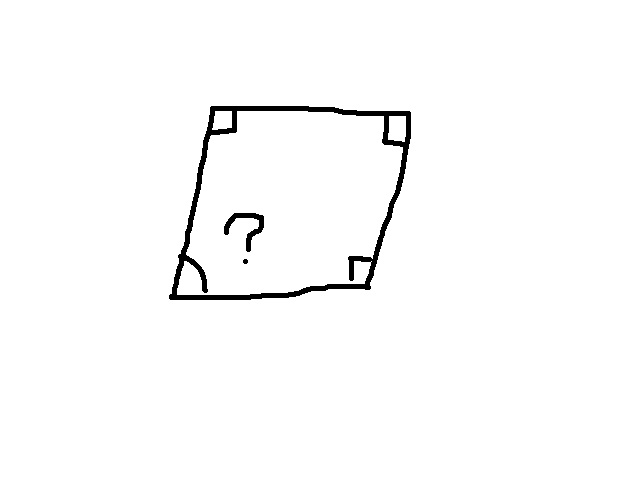
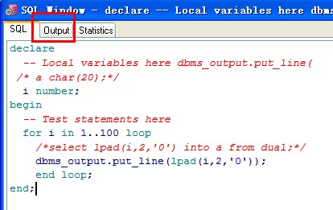
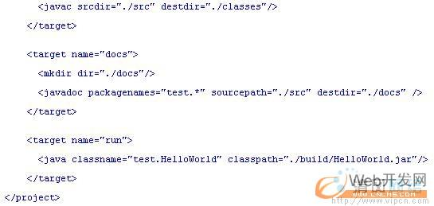

title: How to design DSL
author:
    name: Liu Zhe (drunkedcat)
    url: http://drunkedcat.diandian.com
    email: liu.zhe@admaster.com.cn
output: dsl.html
agenda: true
encoding: utf-8

--
# How to design DSL

LIU ZHE 
2015-03-12

--
### Human
  - how we think / learn / use our knowledge
    - abstract (word, sentence, article, glossary, design pattern, framework)
    - composition
    - compare ( insight )

--
### Human
  - how we do
    - following intuition ( I think ...., realy, you don't think at all )
    - mental set ( our habit )
    - focus on little thing ( always one )
    

--
### What is DSL
  - a language
  - more closer to domain
    - the closest way:  you boss make you to write a 'hello world'
    - more closer to human language

--
### What is DSL
  - such as:
    - html/xml/makrdown
    - sql
    - ant
    - pig
    
    
    

--
### Use or design
  - exists dsl is not you want
  - exists dsl implements some but not all you want
  - so we need design
  - yes, WE NEED DESIGN A LANGUAGE

--
### Bomb
  - WHAT!!!!
  - Gao Da Shang   :)
  - Zhuang 13
  - what is the meaning
    - explain what the TXT file to do
    - make sure it do as it wants  ( you are the GOD)
    - treat it like parsing a config file

--
### How to design DSL
  - using more closer to domain 'words'
  - express more closer to human language 'semantics'
  - design a language
  - how to design dsl

--
### How to design language
  - if you are the GOD......
  - shorter, shorter, .... stop, got it
    - eval, short
    - recursion
  - Abstract
    - definition
    - reference
  - Composition
    - apply function
    - eval expression
  - Compare
    - not care

--
### Most basic elements, eval what (1)
  - literature, variable definition and reference
    - markdown, html not
    - xml maybe, depends on parser (ant)
    - IF NOT
      - REPEAT YOURSELF  (C-c  C-v ?), is evil (how to change everwhere?)
      - above some examples
    - example : x = 3 ; y = x + 1;

--
### Most basic elements, eval what (2)
  - function definition and apply
    - html, markdown, xml  NOT
    - sql partly
    - pig NOT (udf is another way, but not pig itself)
    - IF NOT
      - REPEAT YOURSELF
      - can't compose
      - very limit expression

--
### Most basic elements, eval what (3)
  - there is no 3   :)
  - using (1) and (2), we have lambda calculate
  - using lambda calculate, we can implements almost all

--
### Something to avoid
  - Problems in language
    - obvious
      - memery managment
      -
    - subtle
      - type cast (perl not)
      - indent syntax (python/haskel do)

--
### Balance
  - representability, ease for use
  - flexibility
  - speed

--
### Examples we know
  - SQL
  - ant
  - markdown

--
### My examples
  - java code generator
  - mapping parser

--
### Postface
  -  I hope we don't become missionaries. Don't feel as if you're Bible salesmen. The world has too many of those already. What you know about computing other people will learn. Don't feel as if the key to successful computing is only in your hands. What's in your hands, I think and hope, is intelligence: the ability to see the machine as more than when you were first led up to it, that you can make it more.

    — Alan J. Perlis (April 1, 1922 – February 7, 1990)

