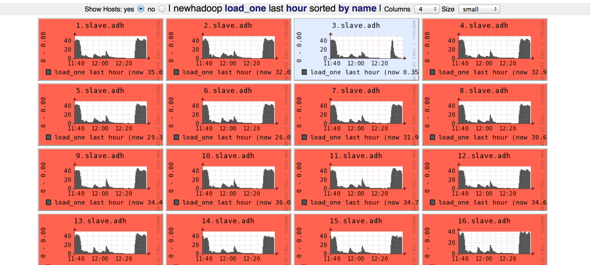

title: 打造稳定高效的 hadoop 平台
author:
    name: 刘喆 (醉猫)
    url: http://drunkedcat.diandian.com
    email: liu.zhe@admaster.com.cn
output: hadoop.html
agenda: true
encoding: utf-8

--

# 打造稳定高效的 hadoop 平台

刘喆 
2015-02-26

--
### 目录
* hadoop 调整的原则
* 辅助工具
* 推荐的角色设置
* 硬件/网络关注点
* OS/JVM 关注点
* hadoop 各角色关注点
* 其它环境
* beyond hadoop
* 后语

--
### hadoop 调整的原则
* 数据导向，不要猜
* 宁死勿慢 （木桶效应）
* 一切都有可能坏，要有备案
  * 内存/cpu
  * 机架掉电
  * 机房地震

--
### 辅助工具
* ganglia （一眼就能看出哪个机器有问题）
  
* pdsh
* jinfo
* jstack
* jmap/jhat

--
### 推荐的角色设置
  
* Namenode 和 ResourceManager 各 1 个 （必须）
* Namenode HA / Secondary Namenode 1 个（必须）
* Balancer 1 个（必须）
* ResourceManager HA 1 个 (可选）
* Clients  越少越好 （必须）
* Datanode/Nodemanager 同机配置

--
### 硬件/网络关注点
* all
  * dns or hosts
  * time ntp
  * 网卡不要自适应，非 1000M，宁可不工作

--
* Namenode
  * 内存要足够大，计算方法 http://www.360doc.com/content/10/1229/09/2159920_82224359.shtml
  * 如果对于文件的创建/删除等操作特别频繁（一般不会，除非有数据证明这是瓶颈），建议用 SSD
  * 主节点和 ResourceManager 最好放在同一机架， 备节点和主节点最好在不同机架
  * 如果不用 HA 方案，硬盘要做 raid1 以上， 不需要很多硬盘，两块数据盘做 raid1 足够

--
* ResourceManager
  * 无特殊要求，除非有数据表明内存不够，要加内存
  * 主备机摆放位置越近越好，但主备机不要放在同一个机架
* Balancer / Clients
  * 不要离集群太远
  * 权限要由管理员统一严格管理

--
* Datanode/Nodemanager
  * 摆放位置离 Namenode 和 ResourceManager 越近越好
  * cpu、内存、网卡、硬盘 的配置最好是一致的，不一致则需要分开配置
  * cpu/内存/网卡带宽/硬盘容量 4 者最好是相匹配的，这里注意木桶效应
  * 最好不要跨核心交换机，如果一定要跨，需要保证交换机间的带宽（交换机数据）

--
### OS 关注点
* 操作系统推荐用 centos 稳定版本，最好统一
* 操作系统参数
  * open files
  * max proc
  * mem overcommit
  * hugepage

--
### JVM 关注点
* jdk 用 oracle 统一版本，推荐 7
  * 一定不要开 swap， 宁可 OOM， 不要开 swap
  * gc 启动参数非常重要，最关键的是 -XX:+UseConcMarkSweepGC， 或者也可以尝试 jdk 7 中新加的 G1
  * 打开 -XX:+PrintGCDetails，或者打到 ganglia， 方便分析 GC 行为
  

--
### hadoop 各角色关注点
* Namenode
  * 一定要设置 3 副本， 2 副本是不安全的
  * 一定要设置 trash
  * topology.script.file.name 数据更安全，访问更迅速（错了就。。。。）
  * dfs.hosts  阻止异常或故意的闯入者

--
* ResourceManager
  * topology.script.file.name 访问更迅速（错了就。。。。）
  * yarn.resourcemanager.nodes.include-path 阻止异常或故意的闯入者
* Namenode HA / Secondary Namenode
  * 配置要同步
  * 建议检查合并过程是否在执行

--
* Datanode
  * dfs.datanode.max.xcievers dfs.datanode.max.transfer.threads  8192
* Nodemanager
  * 最容易坏的是硬盘，sata  2/1000 每天
  * 最容易出的问题是 OOM，加上 cgroup 会好很多
  * yarn.nodemanager.health-checker.script.path  把知识固化的地方
  * yarn.nodemanager.resource.cpu-vcores 控制 slot 数
  * yarn.nodemanager.resource.memory-mb
  * yarn.nodemanager.local-dirs  yarn.nodemanager.log-dirs  多盘分散读写压力

--
* Balancer
  * 机制
  * 定时重启
  * 阈值设置要合理
* Clients
  * hadoop 版本要一致
  * 如果没有特殊的需求，只需要 core-site.xml 配置 NN 和 RM 就可以了，多了就享受不到集群整体的优化

--
### 其它环境
* lzo
* other used libs (python, ruby, pdf, libxml...)

--
### optional
* 机架感知
  * 为什么
  * 计算方式
* 预测执行
  * 好处是什么
  * 坏处？什么时候不能用
    * 多路输出
    * task 除了把输入转化为输出，还做了其它非"幂等"的功能，或需要同步的功能
* GC

--
### beyond hadoop
* 太复杂
  * 刀
  * cloudera
* 自适应性差
* 直觉/改进/创造

--
### 后语
* 文档是不可以执行的，把你的知识固化到可执行的程序里
* 我们的知识总是会过时的，或早或晚
* 方法却一直没有变过：抽象、组合、类比
* 学习不变的，忘掉常变化的
